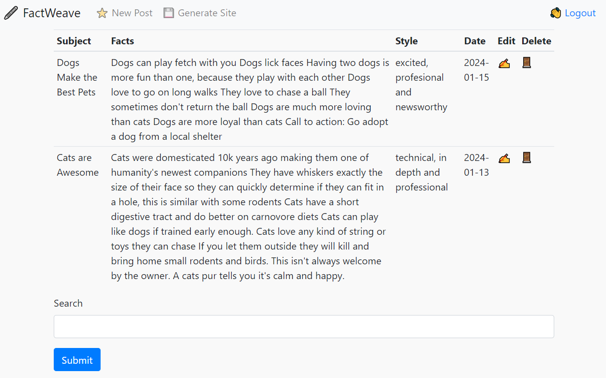
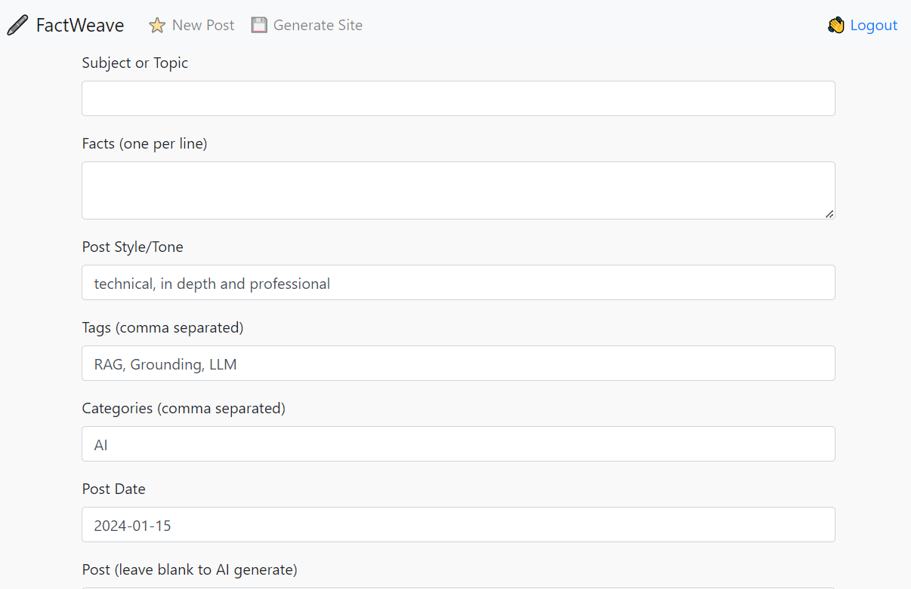

# FactWeave

Facts are all you need (tm) ... and maybe an LLM, a text embedder, Atlas Mongo and some python!

A CMS for producing a static blog site using Hugo and AI. Stop writing long blog posts yourself and your locally hosted open source LLM to do it.

* Create subjects and facts, and have the LLM convert them into blog posts.  
* Export the articles to a static site for upload to your hosting platform.




Example Site:  https://ai.dungeons.ca

## FactWeave Installation

```
pip install -r requirements.txt
```

Rename the mode.json.sample to model.json.  This file is used to set the prompt format and ban tokens, the default is ChatML format so it should work with most recent models.  Set the llama_endpoint to point to your llama.cpp running in server mode.

Also rename the embedder.json.sample to embedder.json.  This will be the endpoint URL for your text embedder service.  I highly recommend using https://github.com/patw/InstructorVec  It's easy to operate and will work out of the box for this application.

Finally rename sample.env to .env and fill in your Atlas connection string and Hugo content/posts path!

### Semantic Search

If you want to enable search, write a blog post first and then add the following search index to your Atlas Search.  This won't work if the ```posts``` collections haven't been created by the app yet.

```
{
  "mappings": {
    "dynamic": false,
    "fields": {
      "fact_embedding": [
        {
          "type": "knnVector",
          "dimensions": 768,
          "similarity": "cosine"
        }
      ]
    }
  }
}
```

### Setting up the Text Embedder

I built this app using https://github.com/patw/InstructorVec however you could modify the source to use Mistral.ai or OpenAI embedding.  Be sure to modify the vector search indexes to use the proper number of dimensions.  

### Downloading an LLM model

We highly recommend OpenHermes 2.5 Mistral-7b fine tune for this task, as it's currently the best (Nov 2023) that
we've tested personally.  You can find different quantized versions of the model here:

https://huggingface.co/TheBloke/OpenHermes-2.5-Mistral-7B-GGUF/tree/main

I'd suggest the Q6 quant for GPU and Q4_K_M for CPU

### Running a model on llama.cpp in API mode

#### Windows

Go to the llama.cpp releases and download either the win-avx2 package for CPU or the cublas for nvidia cards:

https://github.com/ggerganov/llama.cpp/releases

Extract the files out and run the following for nvidia GPUs:
```
server.exe -m <model>.gguf -t 4 -c 2048 -ngl 33 --host 0.0.0.0 --port 8086
```

For CPU only:
```
server.exe -m <model>.gguf -c 2048 --host 0.0.0.0 --port 8086
```

Replace <model> with whatever model you downloaded and put into the llama.cpp directory

#### Linux, MacOS or WSL2
 
Follow the install instructions for llama.cpp at https://github.com/ggerganov/llama.cpp

Git clone, compile and run the following for GPU:
```
./server -m models/<model>.gguf -t 4 -c 2048 -ngl 33 --host 0.0.0.0 --port 8086
```

For CPU only:
```
./server -m models/<model>.gguf -c 2048 --host 0.0.0.0 --port 8086
```

Replace <model> with whatever model you downloaded and put into the llama.cpp/models directory

### Config files

Copy embedder.json.sample to embedder.json and point it to the endpoint for your embedding service (recommend using https://github.com/patw/InstructorVec for least effort)

Copy the model.json.sample to model.json and point it to your llama.cpp running in server mode (see above!)

## Hugo Configuration

* Download and install Hugo from https://gohugo.io/ 
* Create a site using hugo new <site>
* Edit your hugo.toml to have a proper theme and site name
* Edit your content/about.md to have an about page
* Make note of your content/posts directory so you can configure your .env file to point to it (CONTENT variable)
* Build some automation to get hugo to regen the site and upload to your hosting platform!